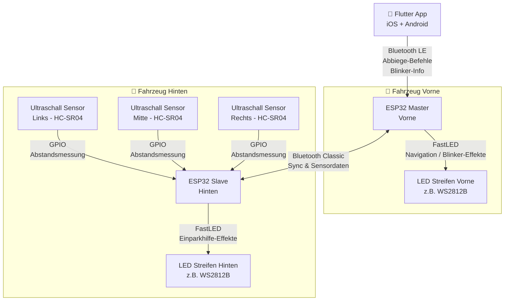

# AmbientNav

[](https://github.com/vergissberlin/ambientnav/actions/workflows/build-app.yml)
[](https://github.com/vergissberlin/ambientnav/actions/workflows/build-firmware.yml)

Ambient LED navigation and parking assistance system for vehicles, inspired by the VW ID.3 ambient lighting. AmbientNav turns addressable LED strips into a real-time navigation guide and proximity warning system using two ESP32 microcontrollers and a cross-platform (Flutter) companion app for iOS and Android.

---

## Overview

```plaintext
📱 Flutter App  ──BLE──▶  ESP32 Front (Master)  ──BT Classic──▶  ESP32 Rear (Slave)
   (iOS/Android)
                              │                                        │
                          LED Strip                               LED Strip
                          (front)                                  (rear)
                                                               ◀── 3× HC-SR04
```

### Use cases

| Scenario                      | Effect                                         |
|-------------------------------|------------------------------------------------|
| Turn left in navigation       | Front LED strip pulses / sweeps left           |
| Turn right in navigation      | Front LED strip pulses / sweeps right          |
| Ambient / driving             | Calm color wash, follows speed / turn signal   |
| Reversing (obstacle far)      | Full rear LED bar lit                          |
| Reversing (obstacle close)    | Rear LED bar progressively narrows from center |
| Reversing (critical distance) | Bar reduces to a few LEDs, color shifts to red |

---

## Architecture



---

## Components

### Hardware

| Component                 | Quantity | Notes                                   |
|---------------------------|----------|-----------------------------------------|
| ESP32 (30-pin DevKit)     | 2        | One front (Master), one rear (Slave)    |
| WS2812B LED strip         | 2        | 5 V, 60 LEDs/m recommended              |
| HC-SR04 ultrasonic sensor | 3        | Left / Center / Right at the rear       |
| 5 V power supply          | 1        | Sized to LED strip current draw         |
| 330 Ω resistors           | 2        | Data line protection for each LED strip |
| 1000 µF capacitor         | 2        | Across 5 V / GND of each LED strip      |

### Compatible Microcontrollers

The project requires the **original ESP32** chip — boards based on ESP32-WROOM-32 or ESP32-WROVER. The chip must support **both Bluetooth Classic (SPP) and BLE simultaneously**. ESP32-S2, S3, C3, C6, and H2 are **not compatible** (no Bluetooth Classic).

| Board | Pins | Notes | Buy |
|---|---|---|---|
| ESP32 DevKit V1 | 30 | **Recommended** — tested, compact | [Amazon](https://www.amazon.de/s?k=ESP32+DevKit+V1+30+Pin&tag=thebeatles-21) |
| ESP32 DevKit V1 | 38 | More GPIOs, slightly larger | [Amazon](https://www.amazon.de/s?k=ESP32+DevKit+V1+38+Pin&tag=thebeatles-21) |
| AZDelivery ESP32 NodeMCU | 30 | Popular in Europe, ships with headers | [Amazon](https://www.amazon.de/s?k=AZDelivery+ESP32+NodeMCU&tag=thebeatles-21) |
| DOIT ESP32 DevKit V1 | 30 | Alternative brand, identical 30-pin pinout | [Amazon](https://www.amazon.de/s?k=DOIT+ESP32+DevKit+V1&tag=thebeatles-21) |

### Software / Services

| Layer                     | Technology                                                                          |
|---------------------------|-------------------------------------------------------------------------------------|
| App — framework           | [Flutter](https://flutter.dev/) (one Dart codebase: iOS + Android; CarPlay / Android Auto scaffolds) |
| App — maps & UI           | [maplibre_gl](https://pub.dev/packages/maplibre_gl) ([OpenStreetMap](https://www.openstreetmap.org/) tiles, offline regions) |
| App — routing             | [Valhalla](https://valhalla.github.io/valhalla/) / OSRM (online) + offline route cache |
| App — voice guidance      | [flutter_tts](https://pub.dev/packages/flutter_tts) (multi-language)                |
| App — BLE                 | [flutter_blue_plus](https://pub.dev/packages/flutter_blue_plus) (central, RSSI, bonding) |
| App — state management    | [Riverpod](https://riverpod.dev/)                                                   |
| ESP32 — LED control       | [FastLED](https://fastled.io/)                                                      |
| ESP32 — front BLE stack   | ESP-IDF NimBLE / Arduino BLE library                                                |
| ESP32 — inter-board comms | ESP-IDF Bluetooth Classic SPP                                                       |

See [`app/README.md`](app/README.md) for the app architecture and features (dark/light mode, voice guidance, offline routes, controller configuration, sensor calibration, LED config, battery voltage, signal strength, secure passkey pairing, firmware OTA).

---

## Data Flow

| From            | To          | Protocol                | Payload                                             |
|-----------------|-------------|-------------------------|-----------------------------------------------------|
| App (phone)     | ESP32 Front | Bluetooth LE (GATT)     | Turn direction, distance to maneuver, blinker state |
| ESP32 Front     | ESP32 Rear  | Bluetooth Classic (SPP) | Sync commands (e.g. "start reverse mode")           |
| ESP32 Rear      | ESP32 Front | Bluetooth Classic (SPP) | Sensor distances (left / center / right, cm)        |
| HC-SR04 sensors | ESP32 Rear  | GPIO (trigger/echo)     | Raw distance measurements                           |

---

## Repository Structure (planned)

```plaintext
ambientnav/
├── app/                    # Flutter app (iOS + Android, CarPlay/Android Auto scaffolds)
│   ├── lib/
│   │   ├── core/           # di, router, theme, l10n, persistence, security
│   │   └── features/
│   │       ├── navigation/ # MapLibre + Valhalla/OSRM routing + voice
│   │       ├── offline/    # offline map region download
│   │       ├── controllers/# BLE: telemetry, LED/sensor config, OTA, pairing
│   │       ├── car/        # CarPlay / Android Auto scaffolds
│   │       └── settings/   # theme & preferences
│   └── test/               # unit + widget tests (run against a mock BLE layer)
├── firmware/
│   ├── front/              # ESP32 Master (Arduino / ESP-IDF)
│   │   ├── src/
│   │   │   ├── main.cpp
│   │   │   ├── ble_server.cpp      # BLE GATT peripheral (iPhone side)
│   │   │   ├── bt_classic.cpp      # SPP client (rear ESP32 side)
│   │   │   └── led_effects.cpp     # FastLED navigation effects
│   │   └── platformio.ini
│   └── rear/               # ESP32 Slave (Arduino / ESP-IDF)
│       ├── src/
│       │   ├── main.cpp
│       │   ├── ultrasonic.cpp      # HC-SR04 driver (3 sensors)
│       │   ├── bt_classic.cpp      # SPP server (front ESP32 side)
│       │   └── led_effects.cpp     # FastLED parking-aid effects
│       └── platformio.ini
└── docs/
    ├── wiring.md           # Pin assignments and wiring diagrams
    ├── ble-protocol.md     # GATT service / characteristic spec
    └── bt-protocol.md      # SPP message format spec
```

---

## Communication Protocols

### BLE — App ↔ ESP32 Front

The phone app acts as a **BLE Central**; the front ESP32 exposes a **GATT Peripheral**. Beyond the navigation packet below, the app uses an **extended GATT protocol** (telemetry/voltage, LED config, sensor config, OTA) protected by **passkey pairing + bonding** — see [`docs`](docs/) → *Protocols*.

```plaintext
Service UUID:     AMBIENT-NAV-0001 (custom 128-bit)
Characteristic:   TURN-CMD  (write without response)
  Payload (3 bytes):
    [0] direction  0x00=none  0x01=left  0x02=right  0x03=straight
    [1] distance   meters to maneuver (0–255)
    [2] blinker    0x00=off   0x01=left  0x02=right  0x03=hazard
```

### Bluetooth Classic SPP — ESP32 Front ↔ ESP32 Rear

Simple newline-delimited JSON over a serial port profile:

```jsonc
// Front → Rear
{ "cmd": "reverse", "active": true }
{ "cmd": "sync",    "ts": 1234567890 }

// Rear → Front
{ "type": "sensors", "left": 85, "center": 62, "right": 91 }  // cm
```

---

## LED Effects

### Front — Navigation

| State          | Effect                                 |
|----------------|----------------------------------------|
| Turn left      | Arrow sweep from center → left, amber  |
| Turn right     | Arrow sweep from center → right, amber |
| Straight ahead | Pulse forward, white                   |
| Idle / ambient | Slow breathing, configurable color     |

### Rear — Parking Aid

Rear strip is divided into three zones (left / center / right), each driven by the corresponding HC-SR04.

| Distance   | LED behavior                       |
|------------|------------------------------------|
| > 150 cm   | Full bar, green                    |
| 100–150 cm | Bar narrows slightly, yellow-green |
| 50–100 cm  | Bar narrows more, amber            |
| 20–50 cm   | Bar almost gone, orange            |
| < 20 cm    | Minimal bar, red, fast blink       |

---

## Getting Started

### Prerequisites

- [Flutter](https://docs.flutter.dev/get-started/install) 3.27+ (Dart 3.6+)
- Xcode 15+ (iOS builds) and/or Android SDK (Android builds)
- [PlatformIO](https://platformio.org/) (VS Code extension or CLI)
- Two ESP32 DevKit boards
- WS2812B LED strips + wiring
- 3× HC-SR04 ultrasonic sensors

### Firmware

```bash
cd firmware/front
pio run --target upload

cd ../../firmware/rear
pio run --target upload
```

### App

```bash
cd app
flutter pub get
flutter gen-l10n
flutter run --dart-define=USE_MOCK=true   # run against the in-memory mock (no hardware)
# Drop USE_MOCK to use real BLE on a physical device
```

See [`app/README.md`](app/README.md) for full app docs.

---

## Power Budget

| Component                   | Current (typical) |
|-----------------------------|-------------------|
| ESP32 (active, BT)          | ~240 mA           |
| WS2812B 60 LEDs @ 50% white | ~900 mA           |
| 3× HC-SR04                  | ~45 mA            |
| **Total (both ends)**       | **~1.4 A @ 5 V**  |

Use a dedicated 5 V / 3 A step-down converter fed from the vehicle's 12 V line. Add a 1000 µF bulk capacitor close to each LED strip connector to absorb switching transients.

---

## Contributing

Issues and PRs are welcome. Please open an issue first for larger features.

---

## License

MIT — see [LICENSE](LICENSE).
