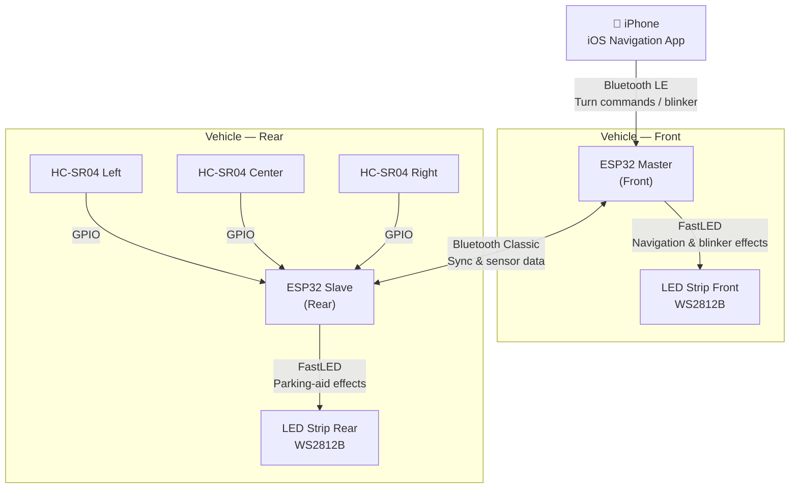

## System Diagram



---

## Hardware Components

| Component | Qty | Role |
|---|---|---|
| ESP32 DevKit (30-pin) | 2 | Front: BLE + LED control. Rear: sensors + LED control |
| WS2812B LED strip (5 V, 60 LEDs/m) | 2 | Addressable RGB lighting, front and rear |
| HC-SR04 ultrasonic sensor | 3 | Rear obstacle distance measurement (L/C/R) |
| 5 V / 3 A step-down converter | 1 | Powers both ESP32 boards and both LED strips |
| 330 Ω resistor | 2 | LED data-line protection |
| 1000 µF capacitor | 2 | LED strip inrush current absorption |

---

## Software Stack

| Layer | Technology |
|---|---|
| iOS maps & UI | [MapLibre Navigation iOS](https://github.com/maplibre/maplibre-navigation-ios) |
| Routing engine | [Valhalla](https://valhalla.github.io/valhalla/) |
| Map tiles | [OpenStreetMap](https://www.openstreetmap.org/) (free, offline-capable) |
| iOS Bluetooth | CoreBluetooth (native iOS framework) |
| ESP32 LED control | [FastLED](https://fastled.io/) |
| ESP32 BLE stack | NimBLE-Arduino (lower memory than Bluedroid) |
| ESP32 Bluetooth Classic | ESP-IDF SPP API |
| ESP32 RTOS | FreeRTOS (built into ESP-IDF) |

---

## Data Flow

| From | To | Protocol | Payload |
|---|---|---|---|
| iPhone | ESP32 Front | Bluetooth LE — GATT Write | 3 bytes: direction, distance, blinker state |
| ESP32 Front | ESP32 Rear | Bluetooth Classic SPP | JSON: sync commands, mode changes |
| ESP32 Rear | ESP32 Front | Bluetooth Classic SPP | JSON: sensor distances (L/C/R in cm) |
| HC-SR04 sensors | ESP32 Rear | GPIO trigger/echo pulses | Raw time-of-flight measurements |

---

## Repository Structure

```
ambientnav/
├── ios/                    # Swift iOS application
│   ├── AmbientNav/
│   │   ├── Navigation/     # MapLibre + Valhalla integration
│   │   ├── Bluetooth/      # CoreBluetooth BLE central
│   │   └── Effects/        # LED command encoding
│   └── AmbientNav.xcodeproj
├── firmware/
│   ├── front/              # ESP32 Master (PlatformIO)
│   │   ├── src/
│   │   │   ├── main.cpp
│   │   │   ├── ble_server.cpp
│   │   │   ├── bt_classic.cpp
│   │   │   └── led_effects.cpp
│   │   └── platformio.ini
│   └── rear/               # ESP32 Slave (PlatformIO)
│       ├── src/
│       │   ├── main.cpp
│       │   ├── ultrasonic.cpp
│       │   ├── bt_classic.cpp
│       │   └── led_effects.cpp
│       └── platformio.ini
└── docs/                   # This Starlight documentation site
```
