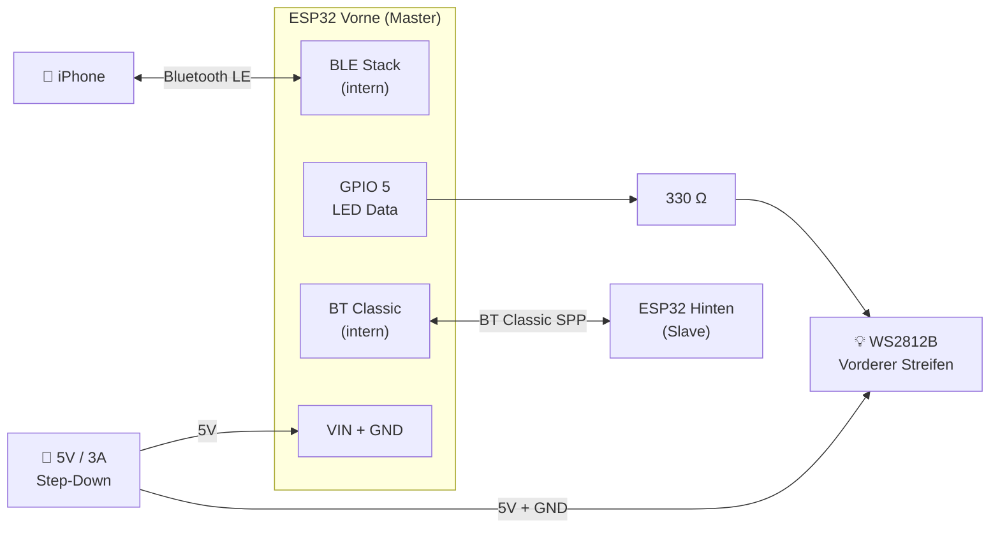
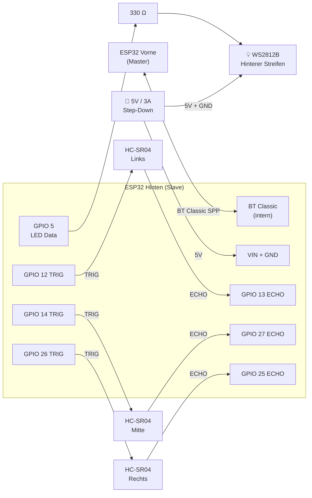
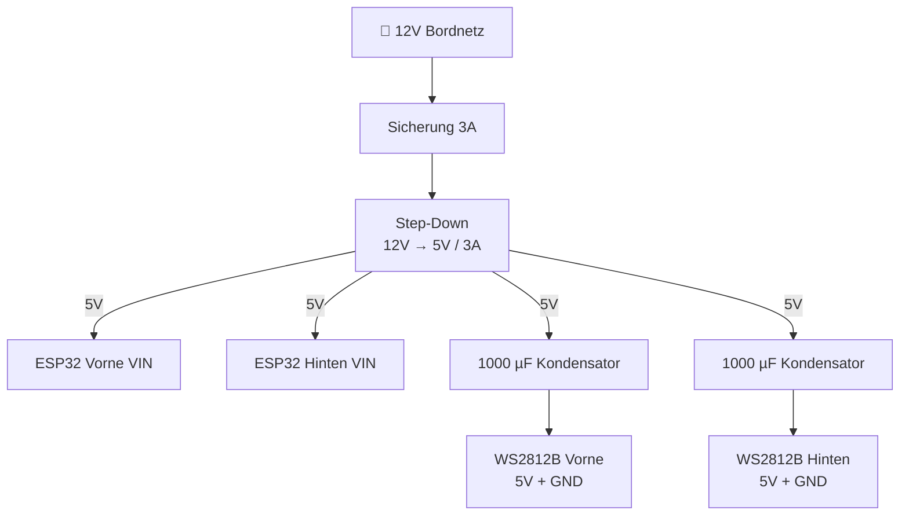

## Vorderer ESP32 (Master)

Das vordere Board übernimmt die BLE-Kommunikation mit dem iPhone und steuert den vorderen LED-Streifen.

### Pin-Tabelle — Vorne

| Pin       | Richtung | Verbunden mit                   |
|-----------|----------|---------------------------------|
| GPIO 5    | OUT      | WS2812B DIN (über 330 Ω)        |
| VIN       | IN       | 5V Step-Down Ausgang            |
| GND       | —        | Gemeinsame Masse                |
| Intern    | BLE      | iPhone (CoreBluetooth)          |
| Intern    | BT Classic| ESP32 Hinten (SPP)             |

:::note
GPIO 0, 2 und 15 nicht für allgemeine I/O verwenden — diese Strapping-Pins beeinflussen den Boot-Modus des ESP32.
:::

***

## Hinterer ESP32 (Slave)

Das hintere Board liest drei HC-SR04-Distanzsensoren aus und steuert den hinteren LED-Streifen.

### Pin-Tabelle — Hinten

| Pin       | Richtung | Verbunden mit                    |
|-----------|----------|----------------------------------|
| GPIO 5    | OUT      | WS2812B DIN (über 330 Ω)         |
| GPIO 12   | OUT      | HC-SR04 Links — TRIG             |
| GPIO 13   | IN       | HC-SR04 Links — ECHO             |
| GPIO 14   | OUT      | HC-SR04 Mitte — TRIG             |
| GPIO 27   | IN       | HC-SR04 Mitte — ECHO             |
| GPIO 26   | OUT      | HC-SR04 Rechts — TRIG            |
| GPIO 25   | IN       | HC-SR04 Rechts — ECHO            |
| VIN       | IN       | 5V Step-Down Ausgang             |
| GND       | —        | Gemeinsame Masse                 |
| Intern    | BT Classic| ESP32 Vorne (SPP)               |

***

## Stromversorgung

Einen **1000 µF / 6,3 V Kondensator** direkt am Steckverbinder jedes LED-Streifens zwischen 5V und GND platzieren, um Einschaltstromspitzen bei Helligkeitswechseln zu dämpfen.
