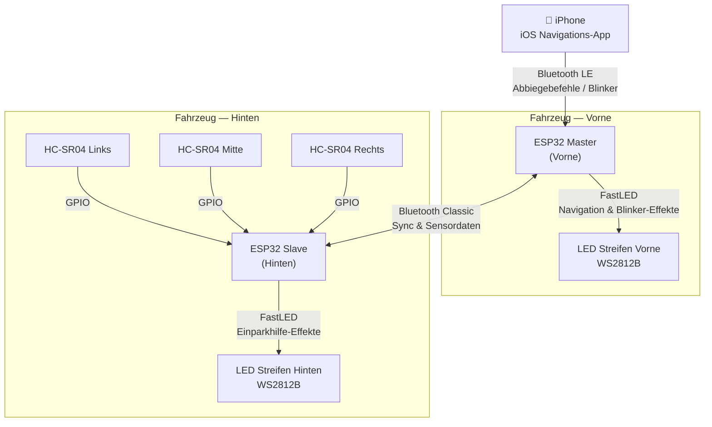

## Systemdiagramm

```
┌──────────────────────────────────────────────────────────────────────┐
│                          AmbientNav System                           │
│                                                                      │
│  ┌──────────────────┐   Bluetooth LE    ┌──────────────────────────┐│
│  │   📱 iPhone       │ ───────────────▶ │  ESP32 Vorne (Master)    ││
│  │   iOS App        │   Abbiegebef./BKR │                          ││
│  └──────────────────┘                   │  • BLE GATT Peripheral   ││
│                                         │  • BT Classic SPP Client ││
│                                         │  • FastLED (vord. Str.)  ││
│                                         └──────────┬───────────────┘│
│                                                    │                 │
│                                         Bluetooth Classic            │
│                                         (SPP — bidirektional)        │
│                                                    │                 │
│                                         ┌──────────▼───────────────┐│
│  HC-SR04 Links  ──GPIO──▶              │  ESP32 Hinten (Slave)    ││
│  HC-SR04 Mitte  ──GPIO──▶              │                          ││
│  HC-SR04 Rechts ──GPIO──▶              │  • HC-SR04 Treiber (×3)  ││
│                                         │  • BT Classic SPP Server ││
│                                         │  • FastLED (hint. Str.)  ││
│                                         └──────────────────────────┘│
└──────────────────────────────────────────────────────────────────────┘
```

### Mermaid-Quellcode



---

## Hardwarekomponenten

| Komponente | Anz. | Funktion |
|---|---|---|
| ESP32 DevKit (30-pin) | 2 | Vorne: BLE + LED-Steuerung. Hinten: Sensoren + LED-Steuerung |
| WS2812B LED-Streifen (5 V, 60 LEDs/m) | 2 | Adressierbares RGB-Licht, vorne und hinten |
| HC-SR04 Ultraschallsensor | 3 | Hindernisabstandsmessung hinten (L/M/R) |
| 5 V / 3 A Step-Down-Wandler | 1 | Versorgt beide ESP32 und beide LED-Streifen |
| 330 Ω Widerstand | 2 | LED-Datenleitungsschutz |
| 1000 µF Kondensator | 2 | Einschaltstromabsorption am LED-Streifen |

---

## Software-Stack

| Schicht | Technologie |
|---|---|
| iOS Karten & UI | [MapLibre Navigation iOS](https://github.com/maplibre/maplibre-navigation-ios) |
| Routing-Engine | [Valhalla](https://valhalla.github.io/valhalla/) |
| Kartenmaterial | [OpenStreetMap](https://www.openstreetmap.org/) (kostenlos, offline-fähig) |
| iOS Bluetooth | CoreBluetooth (natives iOS-Framework) |
| ESP32 LED-Steuerung | [FastLED](https://fastled.io/) |
| ESP32 BLE-Stack | NimBLE-Arduino (geringerer Speicherbedarf als Bluedroid) |
| ESP32 Bluetooth Classic | ESP-IDF SPP API |
| ESP32 RTOS | FreeRTOS (in ESP-IDF integriert) |

---

## Datenfluss

| Von | Nach | Protokoll | Nutzlast |
|---|---|---|---|
| iPhone | ESP32 Vorne | Bluetooth LE — GATT Write | 3 Bytes: Richtung, Abstand, Blinkerstatus |
| ESP32 Vorne | ESP32 Hinten | Bluetooth Classic SPP | JSON: Sync-Befehle, Moduswechsel |
| ESP32 Hinten | ESP32 Vorne | Bluetooth Classic SPP | JSON: Sensorabstände (L/M/R in cm) |
| HC-SR04 Sensoren | ESP32 Hinten | GPIO Trigger/Echo-Impulse | Rohe Laufzeitmessungen |

---

## Repository-Struktur

```
ambientnav/
├── ios/                    # Swift iOS Anwendung
│   ├── AmbientNav/
│   │   ├── Navigation/     # MapLibre + Valhalla Integration
│   │   ├── Bluetooth/      # CoreBluetooth BLE Central
│   │   └── Effects/        # LED-Befehlskodierung
│   └── AmbientNav.xcodeproj
├── firmware/
│   ├── front/              # ESP32 Master (PlatformIO)
│   │   ├── src/
│   │   │   ├── main.cpp
│   │   │   ├── ble_server.cpp
│   │   │   ├── bt_classic.cpp
│   │   │   └── led_effects.cpp
│   │   └── platformio.ini
│   └── rear/               # ESP32 Slave (PlatformIO)
│       ├── src/
│       │   ├── main.cpp
│       │   ├── ultrasonic.cpp
│       │   ├── bt_classic.cpp
│       │   └── led_effects.cpp
│       └── platformio.ini
└── docs/                   # Diese Starlight Dokumentationssite
```
