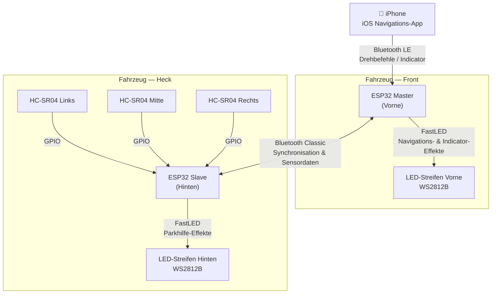

## Systemdiagramm



---

## Hardwarekomponenten

| Komponente | Menge | Rolle |
|---|---|---|
| ESP32 DevKit (30-Pin) | 2 | Vorne: BLE + LED-Steuerung. Hinten: Sensoren + LED-Steuerung |
| WS2812B LED-Streifen (5 V, 60 LEDs/m) | 2 | Adressierbare RGB-Beleuchtung, vorne und hinten |
| HC-SR04 Ultraschallsensor | 3 | Abstandsmessung von Hindernissen hinten (L/C/R) |
| 5 V / 3 A Step-Down-Wandler | 1 | Versorgt beide ESP32-Boards und beide LED-Streifen |
| 330 Ω Widerstand | 2 | Schutz der LED-Datenleitung |
| 1000 µF Kondensator | 2 | Aufnahme des Einschaltstroms des LED-Streifens |

---

## Software-Stack

| Schicht | Technologie |
|---|---|
| iOS Karten & UI | [MapLibre Navigation iOS](https://github.com/maplibre/maplibre-navigation-ios) |
| Routing-Engine | [Valhalla](https://valhalla.github.io/valhalla/) |
| Kartenkacheln | [OpenStreetMap](https://www.openstreetmap.org/) (kostenlos, offline-fähig) |
| iOS Bluetooth | CoreBluetooth (natives iOS-Framework) |
| ESP32 LED-Steuerung | [FastLED](https://fastled.io/) |
| ESP32 BLE-Stack | NimBLE-Arduino (weniger Speicher als Bluedroid) |
| ESP32 Bluetooth Classic | ESP-IDF SPP API |
| ESP32 RTOS | FreeRTOS (in ESP-IDF integriert) |

---

## Datenfluss

| Von | Nach | Protokoll | Nutzlast |
|---|---|---|---|
| iPhone | ESP32 Vorne | Bluetooth LE — GATT Write | 3 Bytes: Richtung, Abstand, Indicator-Status |
| ESP32 Vorne | ESP32 Hinten | Bluetooth Classic SPP | JSON: Synchronisationsbefehle, Moduswechsel |
| ESP32 Hinten | ESP32 Vorne | Bluetooth Classic SPP | JSON: Sensordistanzen (L/C/R in cm) |
| HC-SR04 Sensoren | ESP32 Hinten | GPIO Trigger/Echo-Pulse | Rohzeitmessungen der Flugzeit |

---

## Repository-Struktur

```
ambientnav/
├── ios/                    # Swift iOS application
│   ├── AmbientNav/
│   │   ├── Navigation/     # MapLibre + Valhalla integration
│   │   ├── Bluetooth/      # CoreBluetooth BLE central
│   │   └── Effects/        # LED command encoding
│   └── AmbientNav.xcodeproj
├── firmware/
│   ├── front/              # ESP32 Master (PlatformIO)
│   │   ├── src/
│   │   │   ├── main.cpp
│   │   │   ├── ble_server.cpp
│   │   │   ├── bt_classic.cpp
│   │   │   └── led_effects.cpp
│   │   └── platformio.ini
│   └── rear/               # ESP32 Slave (PlatformIO)
│       ├── src/
│       │   ├── main.cpp
│       │   ├── ultrasonic.cpp
│       │   ├── bt_classic.cpp
│       │   └── led_effects.cpp
│       └── platformio.ini
└── docs/                   # This Starlight documentation site
```