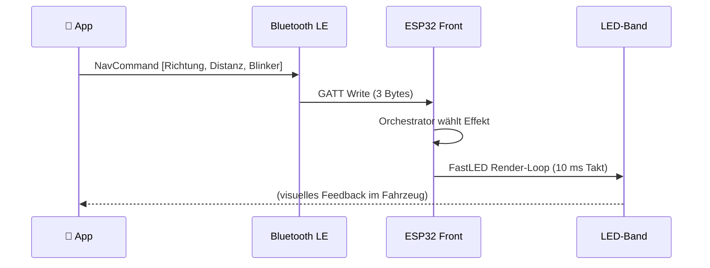
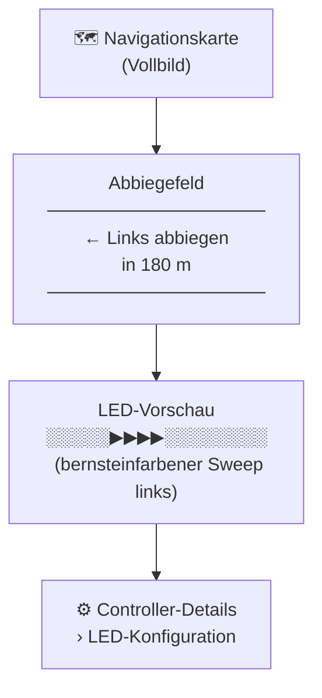

Das vordere LED-Band ist die primäre Navigationsanzeige von AmbientNav. Hinter der Instrumententafel oder im A-Säulen-Zierrahmen montiert, spiegelt es jede Abbiegeanweisung vom Smartphone in Echtzeit wider — ohne Blickkontakt mit dem Display.

---

## Einbauposition

```
┌─────────────────────────────────────────┐
│              Armaturenbrett / Zierleiste│
│  ══════════════════════════════════════ │  ← LED-Band (vorne)
│                                         │
│           Lenkrad  🚗                    │
└─────────────────────────────────────────┘
```

Das Band erstreckt sich über die gesamte Breite der Instrumententafel. Da es im peripheren Sichtfeld liegt, nimmst du den Lichtsweep wahr, ohne den Blick von der Straße abzuwenden.

---

## Navigationseffekte auf einen Blick

| Effekt | Auslöser | Farbe | Animation |
|---|---|---|---|
| `NAV_LEFT` | Linksabbiegen innerhalb 200 m | Bernstein `#FFA500` | Punkt sweept Mitte → links, 600 ms |
| `NAV_RIGHT` | Rechtsabbiegen innerhalb 200 m | Bernstein `#FFA500` | Punkt sweept Mitte → rechts, 600 ms |
| `NAV_STRAIGHT` | Geradeaus weiterfahren | Weiß `#FFFFFF` | Einzelner Puls zur Mitte, 800 ms |
| `INDICATOR_LEFT` | Linker Blinker aktiv | Bernstein `#FFA500` | Linke Hälfte blinkt, 400 ms an/aus |
| `INDICATOR_RIGHT` | Rechter Blinker aktiv | Bernstein `#FFA500` | Rechte Hälfte blinkt, 400 ms an/aus |
| `HAZARD` | Warnblinkanlage | Bernstein `#FFA500` | Gesamtes Band blinkt, 400 ms an/aus |
| `AMBIENT` | Leerlauf / keine Navigation | Konfigurierbar | Langsames Sinuswellen-Atmen, 3 s |

### Effektpriorität

Wenn eine Abbiegung bevorsteht **und** der zugehörige Blinker gleichzeitig aktiv ist, hat der Navigations-Sweep (`NAV_LEFT` / `NAV_RIGHT`) Vorrang — er enthält Distanzinformationen, die der reine Blinkereffekt nicht bietet.

### Sweep-Visualisierung

```
NAV_LEFT — Punkt wandert von der Mitte zur linken Kante:

  t = 0 ms   ░░░░░░░░░████░░░░░░░░░░░░░░░░░░░░
  t = 200 ms ░░░░░████░░░░░░░░░░░░░░░░░░░░░░░░
  t = 400 ms ░░████░░░░░░░░░░░░░░░░░░░░░░░░░░░
  t = 600 ms ████░░░░░░░░░░░░░░░░░░░░░░░░░░░░░
             ← links                   rechts →

NAV_RIGHT — Spiegelbild, Mitte zur rechten Kante.

NAV_STRAIGHT — Puls wächst und verblasst in der Bandmitte:

  t = 0 ms   ░░░░░░░░░░░░░░░░░░░░░░░░░░░░░░░░░
  t = 200 ms ░░░░░░░░░░░░░░░█░░░░░░░░░░░░░░░░░
  t = 400 ms ░░░░░░░░░░░░███████░░░░░░░░░░░░░░
  t = 600 ms ░░░░░░░░░░░█████████░░░░░░░░░░░░░
  t = 800 ms ░░░░░░░░░░░░░░░█░░░░░░░░░░░░░░░░░
```

---

## Steuerung über die App

Die App kodiert jede Navigationsanweisung in ein 3-Byte-Bluetooth-LE-Paket und sendet es an den vorderen ESP32:



**Paketformat:**

| Byte | Feld | Werte |
|---|---|---|
| `[0]` | Richtung | `0x00` keiner · `0x01` links · `0x02` rechts · `0x03` geradeaus |
| `[1]` | Distanz | `0`–`255` Meter zur nächsten Abbiegung |
| `[2]` | Blinker | `0x00` aus · `0x01` links · `0x02` rechts · `0x03` Warnblinker |

Der Effekt startet, sobald die App berechnet, dass die nächste Abbiegung innerhalb von **200 m** liegt.

---

## So sieht es in der App aus

Der Navigationsbildschirm zeigt das aktive Manöver, die Restdistanz und eine Live-LED-Vorschau:



Unter **Controller-Details → LED-Konfiguration** lassen sich Helligkeit und Farbe einstellen:

```
┌─────────────────────────────────────────┐
│  LED-Konfiguration                      │
│                                         │
│  Helligkeit  ────●──────  128           │
│  LED-Anzahl  ──────────●  60            │
│  Effekt      [ Ambient     ▼]           │
│  Ambiente-Farbe  [  ████  ]             │
│                                         │
│          [ Übernehmen ]                 │
└─────────────────────────────────────────┘
```

:::tip
Änderungen an Helligkeit und Ambiente-Farbe werden sofort übernommen — kein Neustart des ESP32 erforderlich.
:::

---

## Konfiguration

Alle Einstellungen werden auf dem ESP32 gespeichert und bleiben nach dem Ausschalten erhalten.

| Parameter | Bereich | Standard | Auswirkung |
|---|---|---|---|
| **Helligkeit** | 0–255 | 128 (50 %) | Globale Intensitätsbegrenzung für alle Effekte |
| **LED-Anzahl** | 1–144 | 60 | Muss mit der physischen Bandlänge übereinstimmen |
| **Effekt** | ambient / nav-Effekte | ambient | Überschreibt aktiven Effekt (für Tests) |
| **Ambiente-Farbe** | RGB | Cyan `#19E3FF` | Farbe des Atmungseffekts im Leerlauf |

:::caution
Eine Helligkeit über 200 bei vollem Weiß kann das 3-A-Strombudget überschreiten. Halte einen 1000-µF-Pufferkondensator direkt am Bandanschluss bereit.
:::

---

## Technische Spezifikationen

| Eigenschaft | Wert |
|---|---|
| LED-Typ | WS2812B (GRB, 800 kHz) |
| Datenpin | GPIO 5 (vorderer ESP32) |
| LED-Anzahl | 60 (konfigurierbar) |
| Datenleitungsschutz | 330-Ω-Widerstand in Reihe |
| Stromversorgung | 5 V / bis zu 1 A bei 50 % Helligkeit |
| Bibliothek | FastLED |
| Render-Takt | 10 ms (FreeRTOS-Task) |
| BLE-Charakteristik | `12345678-1234-5678-1234-56789ABCDEF1` (Write Without Response) |
