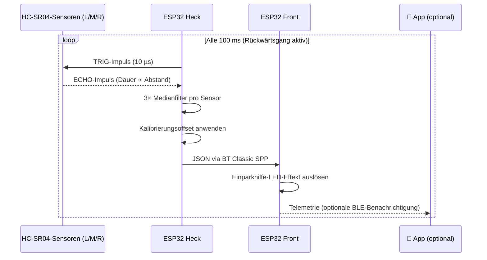
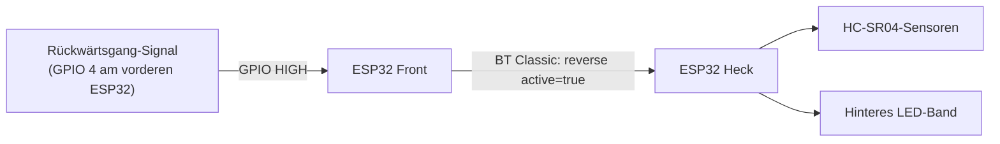

Das hintere Abstandssensorsystem besteht aus drei Ultraschallsensoren, die über die Heckstoßstange verteilt sind. Sobald du den Rückwärtsgang einlegst, beginnen die Sensoren zu messen und liefern eine Echtzeit-Näherungswarnung an das hintere LED-Band — die Sensordaten sind auch in der App für Diagnose und Kalibrierung sichtbar.

---

## Sensor-Anordnung

Drei HC-SR04-Sensoren decken die gesamte Breite der Heckstoßstange in unabhängigen Zonen ab:

```
  Heckstoßstange (von oben gesehen):

  ┌──────────────────────────────────────────────┐
  │                                              │
  │   [Links]       [Mitte]        [Rechts]      │  ← HC-SR04-Sensoren
  │                                              │
  └──────────────────────────────────────────────┘
       Zone L          Zone M          Zone R

  Detektionskegel pro Sensor: ~15° Öffnungswinkel
  Effektiver Bereich: 2 cm – 400 cm (konfigurierbar)
```

Jeder Sensor arbeitet unabhängig — Mitte kann kritisch rot anzeigen, während beide Seiten grün bleiben.

---

## Funktionsweise



**Messablauf (Anti-Übersprechen):**

```
Zeit →   [Links 30ms] [Pause 5ms] [Mitte 30ms] [Pause 5ms] [Rechts 30ms]
         ◀──────────────────── 90 ms gesamt ──────────────────────────▶
```

Sensoren feuern nacheinander mit kleinen Pausen, damit sich ihre Schallkegel nicht gegenseitig stören.

---

## Abstandszonen

| Abstand | Anzeige | Bedeutung |
|---|---|---|
| > 150 cm | Grün, voller Balken | Hindernis weit entfernt — ausreichend Platz |
| 100–150 cm | Gelbgrün, 80 % | Näher kommen — aufmerksam sein |
| 50–100 cm | Bernstein, 50 % | Vorsicht — abbremsen |
| 20–50 cm | Orange, 20 % | Warnung — Stopp-Punkt nahe |
| < 20 cm | Rot, blinkend | Kritisch — sofort anhalten |
| Kein Hindernis | Grün, voller Balken | Zone frei |

:::caution
Die Sensoren arbeiten am besten auf flachen, senkrechten Flächen. Schräge Flächen (z. B. Anhängerkupplung, Fahrradträger) können kürzere oder längere Messwerte als den tatsächlichen Abstand liefern. Kompensiere dies über den Kalibrierungsoffset.
:::

---

## Aktivierung des Rückwärtsgangs

Das Sensorsystem ist **nur im Rückwärtsgang aktiv**. Der vordere ESP32 signalisiert dem hinteren, wenn der Rückwärtsgang eingelegt ist:



Ohne verkabeltes Rückwärtsgang-Signal kann der Rückwärtsmodus auch manuell über die App aktiviert werden — siehe Controller-Details.

---

## So sieht es in der App aus

Der Bildschirm **Sensorkonfiguration** in der App zeigt Messwerte in Echtzeit und ermöglicht die Feinjustierung jedes Sensors:

```
┌─────────────────────────────────────────┐
│  Sensorkonfiguration                    │
│                                         │
│  Aktiver Sensor  [ Fusioniert    ▼ ]   │
│                  Links / Mitte / Rechts │
│                  Fusioniert (auto)      │
│                                         │
│  Live-Messwerte                         │
│  ┌──────┬────────┬──────┐               │
│  │Links │ Mitte  │Rechts│               │
│  │ 87cm │  42cm  │ 120cm│               │
│  └──────┴────────┴──────┘               │
│                                         │
│  Kalibrierungsoffset                    │
│  ◀───────────●──────────▶   +5 cm       │
│  -50 cm               +50 cm           │
│                                         │
│  Maximale Erkennungsreichweite          │
│  ◀───────────────────●──▶  350 cm       │
│  50 cm                   500 cm        │
│                                         │
│            [ Übernehmen ]              │
└─────────────────────────────────────────┘
```

**Navigationspfad in der App:** Startseite → Controller-Liste → Heck-Controller → Tab „Sensoren"

---

## Kalibrierung

Wenn die Abstandsmesswerte systematisch abweichen (z. B. das Band wird zu früh rot), kalibriere über die App:

1. App öffnen und mit dem Heck-Controller verbinden
2. Zu **Controller-Details → Sensorkonfiguration** navigieren
3. Fahrzeug mit bekanntem Hindernis parken (z. B. 1 m vor einer Wand)
4. Angezeigten Messwert ablesen — wenn 85 cm statt 100 cm angezeigt werden, Offset auf **+15 cm** setzen
5. **Übernehmen** tippen — Einstellung wird im nichtflüchtigen Speicher des ESP32 gespeichert

| Einstellung | Bereich | Beschreibung |
|---|---|---|
| **Aktiver Sensor** | Links / Mitte / Rechts / Fusioniert | Welcher Sensor die LED-Anzeige steuert |
| **Kalibrierungsoffset** | −50 cm bis +50 cm | Korrigiert systematische Messfehler |
| **Maximale Reichweite** | 50–500 cm | Abstände darüber gelten als „kein Hindernis" |

:::tip
**Fusioniert** (Standard) zeigt den nächsten Messwert über alle drei Sensoren in der Mittelzone an — nützlich in engen Situationen, in denen jedes Hindernis kritisch ist.
:::

Kalibrierungswerte werden im nichtflüchtigen Speicher (NVS) des ESP32 gespeichert und bleiben nach Stromunterbrechungen und Firmware-Updates erhalten.

---

## Technische Spezifikationen

| Eigenschaft | Wert |
|---|---|
| Sensormodell | HC-SR04 (5 V, Ultraschall) |
| Messbereich | 2–400 cm (Hardware-Limit) |
| Winkelabdeckung | ~15° pro Sensor |
| Abtastrate | 10 Hz (100-ms-Zyklus) |
| Messungen pro Wert | 3 (Medianfilter) |
| Anti-Übersprechen-Pause | 5 ms zwischen Sensoren |
| Gesamter Messzyklus | 90 ms |
| Timeout für veraltete Daten | 500 ms (dann „kein Hindernis") |
| Kalibrierungsspeicher | ESP32-NVS (Flash) |
| Kommunikation zu Front | Bluetooth Classic SPP, JSON mit 10 Hz |

**GPIO-Belegung (hinterer ESP32):**

| Sensor | TRIG-Pin | ECHO-Pin |
|---|---|---|
| Links | GPIO 25 | GPIO 34 |
| Mitte | GPIO 26 | GPIO 35 |
| Rechts | GPIO 27 | GPIO 36 |
