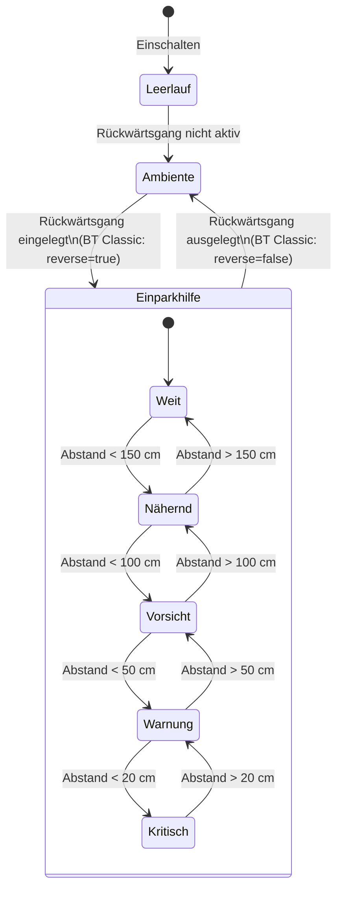
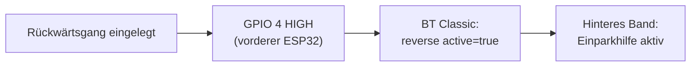

Das hintere LED-Band ist dein visueller Einparkassistent. In drei unabhängige Zonen unterteilt — entsprechend den linken, mittleren und rechten Ultraschallsensoren — zeigt es auf einen Blick, wie viel Platz du in jedem Bereich der Heckstoßstange hast, ohne den Blick von den Spiegeln abzuwenden.

---

## Zonenaufteilung

Das Band ist in drei gleiche Zonen à 20 LEDs aufgeteilt:

```
  Fahrzeugheck (Band von außen betrachtet):

  ┌──────────────────────────────────────────────────────────────────┐
  │  Zone L (LEDs 0–19)   Zone M (LEDs 20–39)  Zone R (LEDs 40–59) │
  │  [████████████████]   [████████████████]   [████████████████]   │
  │        ↑                     ↑                     ↑            │
  │   HC-SR04 Links         HC-SR04 Mitte        HC-SR04 Rechts     │
  └──────────────────────────────────────────────────────────────────┘
```

Jede Zone ist unabhängig. Die Mittelzone kann kritisches Rot anzeigen, während beide Seitenzonen grün bleiben — das Band spiegelt exakt das wider, was jeder Sensor misst.

---

## Farbe und Füllung nach Abstand

Zonenfarbe und -füllung werden 10-mal pro Sekunde aktualisiert, während du rückwärts fährst:

| Abstand | Farbe | Füllung | Blinken | Bedeutung |
|---|---|---|---|---|
| > 150 cm | Grün `#00FF00` | 100 % | Nein | Ausreichend Platz |
| 100–150 cm | Gelbgrün `#AAFF00` | 80 % | Nein | Näherkommend |
| 50–100 cm | Bernstein `#FFA500` | 50 % | Nein | Vorsicht — abbremsen |
| 20–50 cm | Orange `#FF4400` | 20 % | Nein | Stopp-Punkt nahe |
| < 20 cm | Rot `#FF0000` | 10 % | 200 ms | Sofort anhalten |
| Kein Hindernis | Grün `#00FF00` | 100 % | Nein | Zone frei |

### Visuelles Beispiel

```
Hindernis ~120 cm (Mittelzone):

Zone L         Zone M         Zone R
████████████   ████████░░░░   ████████████
(grün 100%)    (gelbgr. 80%)  (grün 100%)
Links frei     Näherkommend   Rechts frei


Hindernis < 20 cm (Mittelzone — kritisch):

Zone L         Zone M         Zone R
████████████   ██░░░░░░░░░░   ████████████
(grün 100%)    (rot, blinkend) (grün 100%)
Links frei      STOP!          Rechts frei
```

---

## Füllformel

Die Zonenfüllung wird pro Sensor unabhängig berechnet:

```
füllung = clamp((abstand_cm − 20) / 130, 0,1; 1,0)
```

Das ergibt:

| Abstand | Berechnete Füllung | Angezeigt |
|---|---|---|
| ≥ 150 cm | 1,0 | 100 % (voller Balken) |
| 85 cm | ≈ 0,50 | 50 % |
| 20 cm | 0,1 (begrenzt) | 10 % + schnelles Blinken |
| < 20 cm | < 0,1 → begrenzt | 10 % + schnelles Blinken |
| 999 (kein Echo) | → 1,0 | 100 % (frei) |

---

## Zustandsdiagramm



---

## Aktivierung

Der Einparkhilfe-Effekt ist **nur im Rückwärtsgang aktiv**. Außerhalb zeigen alle drei Zonen den langsamen bernstein-/cyanfarbenen Atemeffekt **AMBIENT**.

Der Rückwärtsmodus wird ausgelöst durch:
1. **Automatisch** — ein Rückwärtsgang-Signal an GPIO 4 des vorderen ESP32 geht auf HIGH
2. **Manuell** — über den Controller-Detail-Bildschirm in der App umschalten



---

## So sieht es in der App aus

Der Zustand des hinteren LED-Bandes wird im Bildschirm **Controller-Details** für den Heck-Controller angezeigt. Während der Rückwärtsfahrt siehst du die Live-Sensor-Abstände neben dem Band-Verhalten:

```
┌─────────────────────────────────────────┐
│  Heck-Controller                        │
│  ● Verbunden  (BT Classic via Front)   │
│                                         │
│  [ Telemetrie ] [ LED-Konfig ] [Sensor] │
│                                         │
│  Live-Sensor-Abstände                   │
│  ┌──────┬────────┬──────┐               │
│  │Links │ Mitte  │Rechts│               │
│  │ 210cm│  68cm  │ 195cm│               │
│  └──────┴────────┴──────┘               │
│                                         │
│  LED-Band-Vorschau                      │
│  [████████████][████████░░░░][████████] │
│   L: grün       M: bernstein  R: grün   │
│                                         │
└─────────────────────────────────────────┘
```

**Navigationspfad in der App:** Startseite → Controller-Liste → Heck-Controller → Tab „Telemetrie"

---

## Konfiguration

Helligkeit und LED-Anzahl des hinteren Bandes lassen sich unter **Controller-Details → LED-Konfiguration** einstellen:

| Parameter | Bereich | Standard | Hinweise |
|---|---|---|---|
| **Helligkeit** | 0–255 | 128 | Globale Begrenzung; Farbton und Füllung bleiben unverändert |
| **LED-Anzahl** | 1–144 | 60 | Muss durch 3 teilbar sein für gleiche Zonen |

:::note
Die drei Zonen sind immer gleich groß: `zonengröße = led_anzahl / 3`. Bei einem Band mit 45 LEDs belegt jede Zone 15 LEDs.
:::

---

## Technische Spezifikationen

| Eigenschaft | Wert |
|---|---|
| LED-Typ | WS2812B (GRB, 800 kHz) |
| Datenpin | GPIO 18 (hinterer ESP32) |
| LED-Anzahl | 60 (konfigurierbar, muss ÷ 3 sein) |
| Zonenanzahl | 3 (Links / Mitte / Rechts), je 20 LEDs |
| Datenleitungsschutz | 330-Ω-Widerstand in Reihe |
| Stromversorgung | 5 V (geteilt mit hinterem ESP32) |
| Bibliothek | FastLED |
| Aktualisierungsrate | 10 Hz (durch Sensor-Loop gesteuert) |
| Blinkperiode (< 20 cm) | 200 ms an / 200 ms aus |
| Aktivierung | BT-Classic-Befehl vom vorderen ESP32 |
