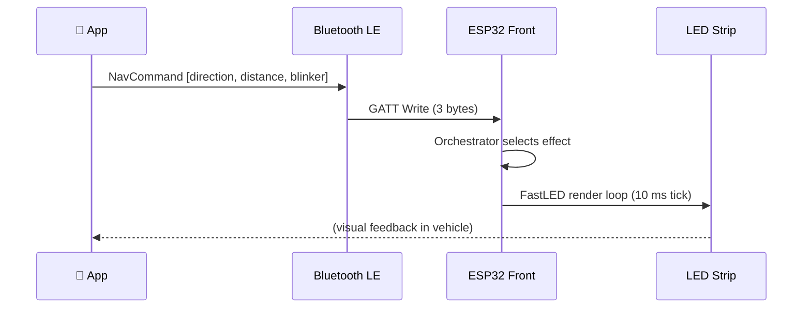
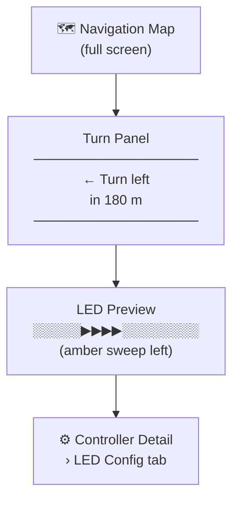

The front LED strip is AmbientNav's primary navigation display. Mounted behind your dashboard or windshield trim, it reflects every turn instruction from your phone in real time — no need to glance at the screen while driving.

---

## Where It Is Mounted

```
┌─────────────────────────────────────────┐
│              Dashboard / Trim           │
│  ══════════════════════════════════════ │  ← LED Strip (front)
│                                         │
│           Steering wheel  🚗             │
└─────────────────────────────────────────┘
```

The strip runs the full width of the instrument panel or A-pillar trim. Because it sits in your peripheral field of vision, you perceive the light sweep without looking away from the road.

---

## Navigation Effects at a Glance

| Effect | Trigger | Color | Animation |
|---|---|---|---|
| `NAV_LEFT` | Turn left within 200 m | Amber `#FFA500` | Dot sweeps center → left, 600 ms cycle |
| `NAV_RIGHT` | Turn right within 200 m | Amber `#FFA500` | Dot sweeps center → right, 600 ms cycle |
| `NAV_STRAIGHT` | Continue straight | White `#FFFFFF` | Single pulse toward center, 800 ms |
| `INDICATOR_LEFT` | Left blinker active | Amber `#FFA500` | Left half blinks, 400 ms on/off |
| `INDICATOR_RIGHT` | Right blinker active | Amber `#FFA500` | Right half blinks, 400 ms on/off |
| `HAZARD` | Hazard lights | Amber `#FFA500` | Full strip blinks, 400 ms on/off |
| `AMBIENT` | Idle / no navigation | Configurable | Slow sine breathing, 3 s period |

### Effect Priority

When a turn is imminent **and** the matching indicator is active, the navigation sweep (`NAV_LEFT` / `NAV_RIGHT`) takes priority — it carries distance information that the pure blinker effect does not.

### Sweep Visualization

```
NAV_LEFT — dot travels from center to left edge:

  t = 0 ms   ░░░░░░░░░████░░░░░░░░░░░░░░░░░░░░
  t = 200 ms ░░░░░████░░░░░░░░░░░░░░░░░░░░░░░░
  t = 400 ms ░░████░░░░░░░░░░░░░░░░░░░░░░░░░░░
  t = 600 ms ████░░░░░░░░░░░░░░░░░░░░░░░░░░░░░
             ← left                      right →

NAV_RIGHT — mirror image, center to right edge.

NAV_STRAIGHT — pulse grows and fades at strip center:

  t = 0 ms   ░░░░░░░░░░░░░░░░░░░░░░░░░░░░░░░░░
  t = 200 ms ░░░░░░░░░░░░░░░█░░░░░░░░░░░░░░░░░
  t = 400 ms ░░░░░░░░░░░░███████░░░░░░░░░░░░░░
  t = 600 ms ░░░░░░░░░░░█████████░░░░░░░░░░░░░
  t = 800 ms ░░░░░░░░░░░░░░░█░░░░░░░░░░░░░░░░░
```

---

## How the App Controls the Strip

The app encodes every navigation instruction into a 3-byte Bluetooth LE packet and sends it to the front ESP32:



**Packet format:**

| Byte | Field | Values |
|---|---|---|
| `[0]` | Direction | `0x00` none · `0x01` left · `0x02` right · `0x03` straight |
| `[1]` | Distance | `0`–`255` metres to next maneuver |
| `[2]` | Blinker | `0x00` off · `0x01` left · `0x02` right · `0x03` hazard |

The effect activates as soon as the app calculates that the next turn is within **200 m**. The sweep speed does not change with distance — only the color and direction of the effect matter.

---

## How It Looks in the App

The app's navigation screen shows the active maneuver, remaining distance, and a live LED preview widget:



To adjust the LED behavior, tap **Controller Detail → LED Config**:

```
┌─────────────────────────────────┐
│  LED Configuration              │
│                                 │
│  Brightness  ────●──────  128   │
│  LED Count   ──────────●  60    │
│  Effect      [ Ambient     ▼]   │
│  Ambient Color  [  ████  ]      │
│                                 │
│          [ Apply ]              │
└─────────────────────────────────┘
```

:::tip
Changes to brightness and ambient color take effect immediately — you do not need to restart the ESP32.
:::

---

## Configuration

All settings are stored on the ESP32 and persist across power cycles.

| Parameter | Range | Default | Effect |
|---|---|---|---|
| **Brightness** | 0–255 | 128 (50 %) | Global intensity cap; affects all effects |
| **LED Count** | 1–144 | 60 | Match your physical strip length |
| **Effect** | ambient / nav effects | ambient | Override active effect (testing) |
| **Ambient Color** | RGB | Cyan `#19E3FF` | Color used by the breathing idle effect |

:::caution
Setting brightness above 200 at full white can exceed the 3 A power budget. Keep a 1000 µF bulk capacitor at the strip connector to absorb peaks.
:::

---

## Technical Specs

| Property | Value |
|---|---|
| LED type | WS2812B (GRB, 800 kHz) |
| Data pin | GPIO 5 (front ESP32) |
| LED count | 60 (configurable) |
| Data line protection | 330 Ω resistor in series |
| Power | 5 V / up to 1 A at 50 % brightness |
| Library | FastLED |
| Render tick | 10 ms (FreeRTOS task) |
| BLE characteristic | `12345678-1234-5678-1234-56789ABCDEF1` (Write Without Response) |
