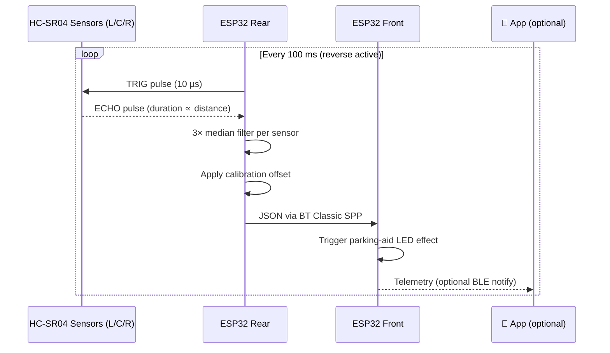
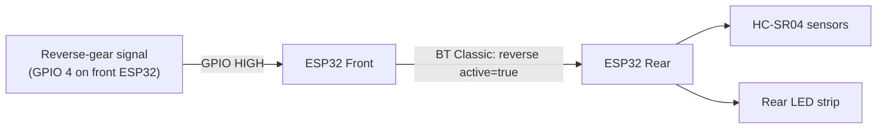

The rear distance sensor system uses three ultrasonic sensors mounted across the rear bumper. When you engage reverse gear, the sensors start measuring and feed a live proximity warning to the rear LED strip — with sensor data also visible in the app for diagnostics and calibration.

---

## Sensor Layout

Three HC-SR04 sensors cover the full width of the rear bumper in independent zones:

```
  Rear bumper (viewed from above):

  ┌──────────────────────────────────────────────┐
  │                                              │
  │   [Left]        [Center]        [Right]      │  ← HC-SR04 sensors
  │                                              │
  └──────────────────────────────────────────────┘
       Zone L          Zone C          Zone R

  Detection cone per sensor: ~15° opening angle
  Effective range: 2 cm – 400 cm (configurable)
```

Each sensor is independent — you can have a clear center while an obstacle is detected on the left, and the LED strip will reflect exactly that.

---

## How It Works



**Measurement cycle (anti-crosstalk):**

```
Time →   [Left 30ms] [gap 5ms] [Center 30ms] [gap 5ms] [Right 30ms]
         ◀──────────────────── 90 ms total ─────────────────────────▶
```

Sensors fire one at a time with small gaps to prevent their sound cones from interfering with each other.

---

## Distance Zones

| Distance | Indicator | Meaning |
|---|---|---|
| > 150 cm | Green, full bar | Obstacle far — plenty of room |
| 100–150 cm | Yellow-green, 80 % | Getting closer — start watching |
| 50–100 cm | Amber, 50 % | Caution — slow down |
| 20–50 cm | Orange, 20 % | Warning — near stop point |
| < 20 cm | Red, blinking | Critical — stop immediately |
| No obstacle | Green, full bar | Zone clear |

:::caution
The sensors work best on flat, perpendicular surfaces. Angled surfaces (e.g. tow bars, bicycle racks) may return shorter or longer readings than actual distance. Use the calibration offset to compensate.
:::

---

## Reverse Mode Activation

The sensor system is **only active during reverse**. The front ESP32 signals the rear when reverse gear is engaged:



Without a reverse-gear signal wired in, you can also activate reverse mode manually via the app — see the Controller Detail screen.

---

## How It Looks in the App

The **Sensor Calibration** screen in the app shows live readings and lets you fine-tune each sensor:

```
┌─────────────────────────────────────────┐
│  Sensor Configuration                   │
│                                         │
│  Active Sensor   [ Fused         ▼ ]   │
│                  Left / Center / Right  │
│                  Fused (auto-select)    │
│                                         │
│  Live Readings                          │
│  ┌──────┬────────┬──────┐               │
│  │ Left │ Center │ Right│               │
│  │ 87cm │  42cm  │ 120cm│               │
│  └──────┴────────┴──────┘               │
│                                         │
│  Calibration Offset                     │
│  ◀───────────●──────────▶   +5 cm       │
│  -50 cm               +50 cm           │
│                                         │
│  Max Detection Range                    │
│  ◀───────────────────●──▶  350 cm       │
│  50 cm                   500 cm        │
│                                         │
│            [ Apply ]                    │
└─────────────────────────────────────────┘
```

**App navigation path:** Home → Controller List → Rear Controller → Sensor Config tab

---

## Calibration

If the distance readings seem consistently off (e.g. the strip turns red too early), calibrate from the app:

1. Open the app and connect to the rear controller
2. Navigate to **Controller Detail → Sensor Config**
3. Park the vehicle with a known obstacle (e.g. 1 m from a wall)
4. Note the displayed reading — if it shows 85 cm instead of 100 cm, set offset to **+15 cm**
5. Tap **Apply** — the setting is stored in non-volatile memory on the ESP32

| Setting | Range | Description |
|---|---|---|
| **Active Sensor** | Left / Center / Right / Fused | Which sensor drives the LED display |
| **Calibration Offset** | −50 cm to +50 cm | Corrects systematic measurement error |
| **Max Detection Range** | 50–500 cm | Distances beyond this are treated as "no obstacle" |

:::tip
**Fused** mode (default) displays the closest reading across all three sensors in the center zone — useful for tight spaces where any obstacle is critical.
:::

Calibration values are saved to the ESP32's non-volatile storage (NVS) and survive power cycles and firmware updates.

---

## Technical Specs

| Property | Value |
|---|---|
| Sensor model | HC-SR04 (5 V, ultrasonic) |
| Measurement range | 2–400 cm (hardware limit) |
| Angular coverage | ~15° per sensor |
| Sampling rate | 10 Hz (100 ms cycle) |
| Readings per measurement | 3 (median filter applied) |
| Anti-crosstalk gap | 5 ms between sensors |
| Total measurement cycle | 90 ms |
| Stale detection timeout | 500 ms (shows "no obstacle" if silent) |
| Calibration storage | ESP32 NVS (flash) |
| Communication to front | Bluetooth Classic SPP, JSON at 10 Hz |

**GPIO pin assignments (rear ESP32):**

| Sensor | TRIG pin | ECHO pin |
|---|---|---|
| Left | GPIO 25 | GPIO 34 |
| Center | GPIO 26 | GPIO 35 |
| Right | GPIO 27 | GPIO 36 |
