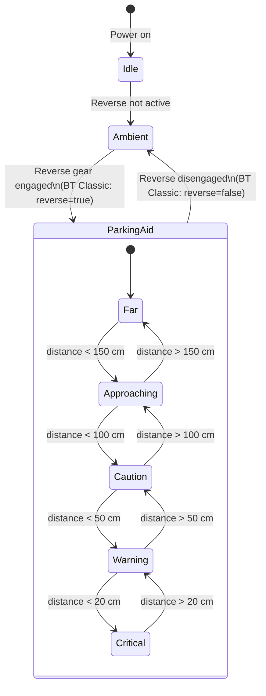
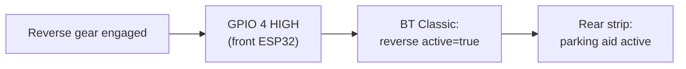

The rear LED strip is your visual parking assistant. Divided into three independent zones that correspond to the left, center, and right ultrasonic sensors, it shows at a glance how much space you have in each part of the rear bumper — without taking your eyes off the mirrors.

---

## Zone Layout

The strip is split into three equal zones of 20 LEDs each:

```
  Rear of vehicle (looking at the strip from outside):

  ┌──────────────────────────────────────────────────────────────────┐
  │  Zone L (LEDs 0–19)  Zone C (LEDs 20–39)  Zone R (LEDs 40–59)  │
  │  [████████████████]  [████████████████]   [████████████████]    │
  │        ↑                    ↑                     ↑             │
  │   HC-SR04 Left         HC-SR04 Center        HC-SR04 Right      │
  └──────────────────────────────────────────────────────────────────┘
```

Each zone is independent. The center zone can show critical red while both side zones remain green — the strip shows exactly what each sensor measures.

---

## Color and Fill by Distance

The zone fill and color update 10 times per second as you reverse:

| Distance | Color | Fill | Blink | What it means |
|---|---|---|---|---|
| > 150 cm | Green `#00FF00` | 100 % | No | Plenty of room |
| 100–150 cm | Yellow-green `#AAFF00` | 80 % | No | Getting closer |
| 50–100 cm | Amber `#FFA500` | 50 % | No | Caution — slow down |
| 20–50 cm | Orange `#FF4400` | 20 % | No | Near stop point |
| < 20 cm | Red `#FF0000` | 10 % | 200 ms | Stop immediately |
| No obstacle | Green `#00FF00` | 100 % | No | Zone clear |

### Visual Example

```
Obstacle ~120 cm away (Center zone):

Zone L         Zone C         Zone R
████████████   ████████░░░░   ████████████
(green 100%)   (yel-grn 80%)  (green 100%)
Left clear     Getting closer  Right clear


Obstacle < 20 cm (Center zone — critical):

Zone L         Zone C         Zone R
████████████   ██░░░░░░░░░░   ████████████
(green 100%)   (red, blinking) (green 100%)
Left clear      STOP!          Right clear
```

---

## Fill Formula

Zone fill is calculated per sensor, independently:

```
fill = clamp((distance_cm − 20) / 130, 0.1, 1.0)
```

This maps:

| Distance | Calculated fill | Displayed |
|---|---|---|
| ≥ 150 cm | 1.0 | 100 % (full bar) |
| 85 cm | ≈ 0.50 | 50 % |
| 20 cm | 0.1 (clamped) | 10 % + fast blink |
| < 20 cm | < 0.1 → clamped | 10 % + fast blink |
| 999 (no echo) | → 1.0 | 100 % (clear) |

---

## State Machine



---

## When It Activates

The parking-aid effect is **only active in reverse mode**. Outside of reverse, all three zones show the slow amber/cyan breathing **AMBIENT** effect instead.

Reverse mode is triggered by:
1. **Automatic** — a reverse-gear signal wired to GPIO 4 on the front ESP32 switches HIGH
2. **Manual** — toggled from the app's controller detail screen



---

## How It Looks in the App

The rear LED strip state is reflected in the **Controller Detail** screen for the rear controller. During reverse, you see the live sensor distances alongside the strip behavior:

```
┌─────────────────────────────────────────┐
│  Rear Controller                        │
│  ● Connected  (BT Classic via Front)   │
│                                         │
│  [ Telemetry ] [ LED Config ] [ Sensors]│
│                                         │
│  Live Sensor Distances                  │
│  ┌──────┬────────┬──────┐               │
│  │ Left │ Center │ Right│               │
│  │ 210cm│  68cm  │ 195cm│               │
│  └──────┴────────┴──────┘               │
│                                         │
│  LED Strip Preview                      │
│  [████████████][████████░░░░][████████] │
│   L: green      C: amber      R: green  │
│                                         │
└─────────────────────────────────────────┘
```

**App navigation path:** Home → Controller List → Rear Controller → Telemetry tab

---

## Configuration

The rear strip brightness and LED count can be adjusted under **Controller Detail → LED Config**:

| Parameter | Range | Default | Notes |
|---|---|---|---|
| **Brightness** | 0–255 | 128 | Global cap; color hue and fill are not affected |
| **LED Count** | 1–144 | 60 | Set to match your physical strip (must be divisible by 3 for equal zones) |

:::note
The three zones are always equal in size: `zone_size = led_count / 3`. If your strip has 45 LEDs, each zone occupies 15 LEDs.
:::

---

## Technical Specs

| Property | Value |
|---|---|
| LED type | WS2812B (GRB, 800 kHz) |
| Data pin | GPIO 18 (rear ESP32) |
| LED count | 60 (configurable, must be ÷ 3) |
| Zone count | 3 (Left / Center / Right), 20 LEDs each |
| Data line protection | 330 Ω resistor in series |
| Power supply | 5 V (shared with rear ESP32) |
| Library | FastLED |
| Update rate | 10 Hz (driven by sensor loop) |
| Blink period (< 20 cm) | 200 ms on / 200 ms off |
| Activation | BT Classic command from front ESP32 |
