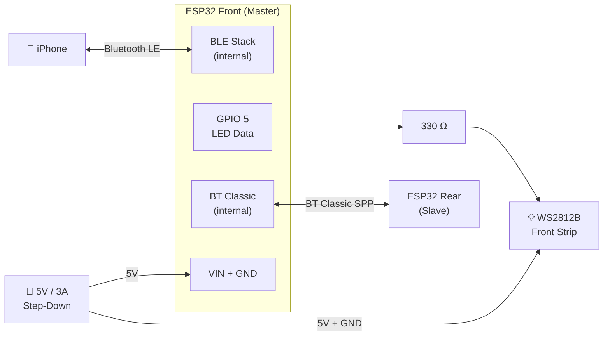
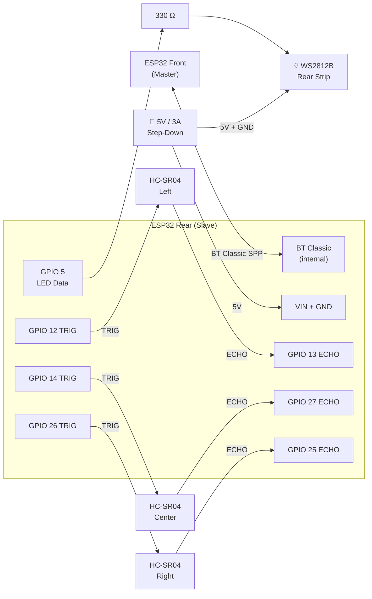
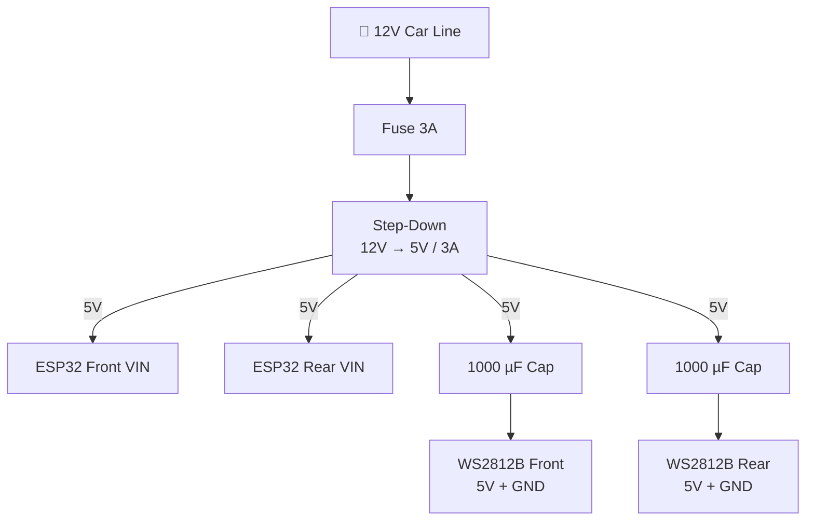

## Front ESP32 (Master)

The front board handles BLE communication with the iPhone and drives the front LED strip.

### Pin Table — Front

| Pin       | Direction | Connected to               |
|-----------|-----------|----------------------------|
| GPIO 5    | OUT       | WS2812B DIN (via 330 Ω)    |
| VIN       | IN        | 5 V step-down output       |
| GND       | —         | Common ground              |
| Internal  | BLE       | iPhone (CoreBluetooth)     |
| Internal  | BT Classic| ESP32 Rear (SPP)           |

:::note
Avoid GPIO 0, 2, and 15 for general I/O — these are strapping pins that influence the ESP32 boot mode.
:::

---

## Rear ESP32 (Slave)

The rear board reads three HC-SR04 distance sensors and drives the rear LED strip.

### Pin Table — Rear

| Pin       | Direction | Connected to                  |
|-----------|-----------|-------------------------------|
| GPIO 5    | OUT       | WS2812B DIN (via 330 Ω)       |
| GPIO 12   | OUT       | HC-SR04 Left — TRIG           |
| GPIO 13   | IN        | HC-SR04 Left — ECHO           |
| GPIO 14   | OUT       | HC-SR04 Center — TRIG         |
| GPIO 27   | IN        | HC-SR04 Center — ECHO         |
| GPIO 26   | OUT       | HC-SR04 Right — TRIG          |
| GPIO 25   | IN        | HC-SR04 Right — ECHO          |
| VIN       | IN        | 5 V step-down output          |
| GND       | —         | Common ground                 |
| Internal  | BT Classic| ESP32 Front (SPP)             |

---

## Power Distribution

Place a **1000 µF / 6.3 V capacitor** across 5 V and GND directly at each LED strip connector to absorb inrush current during brightness transitions.
